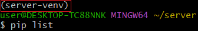
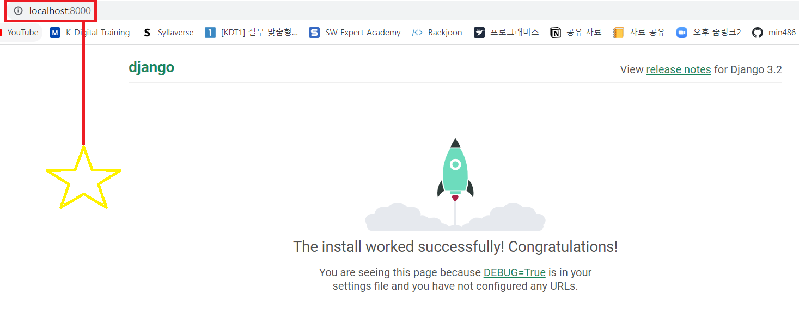

<div align="center">
  <p>
    
  </p>
  <br>
  <h2>Django 시작</h2>
  <p>배운내용 정리 하였습니다</p>
  <br>
  <br>
</div>


## 🔥 Goal

- 클라이언트와 서버의 연결관계를 설명해본다
- 정적 / 동적 웹 페이지 차이를 설명해본다
- Git Bash에서 가상환경 실행 > Django 설치 > 웹 서버 구축까지 해본다


## ⭐ 목차

> Framework
>
> Django
> 
>Django 사용 이유
> 
>클라이언트와 서버
> 
> - 클라이언트 (Client)
>- 서버 (Server)
> 
>정적 / 동적 웹 페이지
> 
> - 정적 웹 페이지 (Static)
>- 동적 웹 페이지 (Dynamic)
> 
>Git Bash에서 웹 서버 구축
> 
> 1. 처음 확인사항
>
> 2. 가상환경 실행
>
> 3. Django 설치 & 서버 구동
> 
> 4. 이후

## 🔧세부 내용

### Framework

서비스 개발에 필요한 기능들을 미리 구현해서 모아 놓은 것


### Django

서버를 구현하는 웹 프레임워크


### Django 사용 이유

- Python으로 작성된 프레임워크

- 수많은 여러 유용한 기능들

- 검증된 웹 프레임워크 (인기 순위)


### 클라이언트와 서버

#### 클라이언트 (Client)

> 서비스를 요청하는 주체

#### 서버 (Server)

> 요청에 대해 서비스를 응답하는 주체


### 정적 / 동적 웹 페이지

#### 정적 웹 페이지 (Static)

> 서버에 정해진 내용이 있는 그대로 전달되는 것

#### 동적 웹 페이지 (Dynamic)

> 사용자의 요청에 따라 변화되어 클라이언트에게 전달되는 것


### Git Bash에서 웹 서버 구축

Git Bash에서 처음 `~` 표시는 `/c/Users/user` 위치를 의미한다


1. 처음 확인사항

   ```bash
   $ python --version  # 파이썬 설치되어있는지 확인
   $ mkdir server  # 폴더 생성
   ```

2. 가상환경 실행

   ```bash
   $ cd server  # 폴더로 이동
   $ python -m venv server-venv  # 가상환경 생성
   $ ls  # 가상환경 이름 확인
   server-venv/
   $ source server-venv/Scripts/activate  # 가상환경 실행, 실행하면 (이름) 나타남
   ```

   

2. Django 설치 & 서버 구동
   
   ```bash
   $ pip install django==3.2.13  # 현재 가장 안정적인 django 버전(3.2.13) 설치
   $ pip list  # 설치된 것들 확인
   $ django-admin startproject firstpjt .  # 프로젝트 시작 명령 [프로젝트이름] [시작할경로]
   $ ls  # 프로젝트 확인
   firstpjt/  manage.py*  server-venv/
   $ python manage.py runserver  # 서버 구동
   ```



4. 이후
	```bash
   Ctrl + c  # server 종료하기
   $ deactivate  # 가상환경 끄기
   $ code .  # vscode로 열기 
   ```
