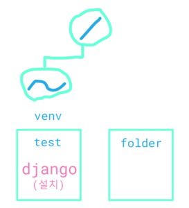
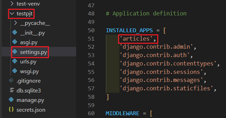
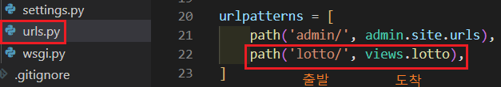
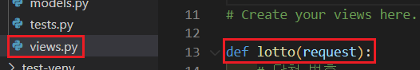
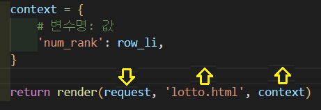
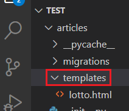
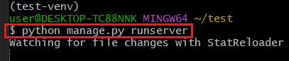
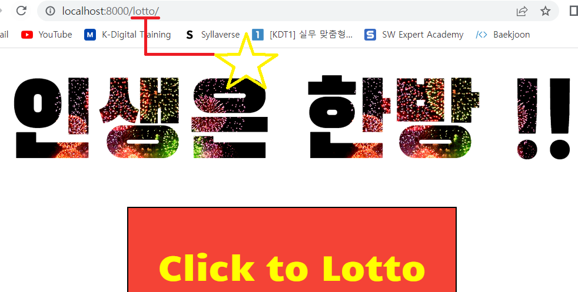

<div align="center">
  <p>
    
  </p>
  <br>
  <h2>Django 02</h2>
  <p>앱, URL, VIEW, TEMPLATES 내용 정리</p>
  <br>
  <br>
</div>


## 🔥 목차

> 처음 세팅
>
> 1. 가상환경 생성, 실행
> 2. Django LTS 버전 설치
> 3. Django 프로젝트 생성
>
> 앱 생성
>
> 앱 등록
>
> 앱 삭제
>
> 요청과 응답
>
> 요청과 응답 - 데이터 흐름
>
> 1. URL (urls.py)
>2. VIEW (views.py)
> 3. TEMPLATES                
> 
> [step 1] URL
>
> [step 2] VIEW
>
> [step 3] TEMPLATES

## 🔧세부 내용

### 처음 세팅

1. 가상환경 생성, 실행

    ```bash
    $ cd test  # 폴더로 이동
    $ python -m venv test-venv  # 가상환경 생성
    $ ls  # 가상환경 이름 확인
    test-venv/
    $ source test-venv/Scripts/activate  # 가상환경 실행
    ```
    
2. Django LTS 버전 설치

    ```bash
    $ pip install django==3.2.13  # 현재 가장 안정적인 django 버전(3.2.13) 설치
    $ pip list  # Django 설치되어있는지 확인 
    ```

3. Django 프로젝트 생성

   ```bash
   $ django-admin startproject testpjt .  # 프로젝트 시작 명령 [프로젝트이름] [시작할경로]
   $ ls  # 프로젝트 확인
   testpjt/
   ```



### 앱 생성

> manage.py 있는 경로에서 실행, $ ls 로 있는지 확인하기

```bash
$ python manage.py startapp articles  # 앱 생성 [앱 이름]
```


### 앱 등록

> 프로젝트 > settings.py > INSTALLED_APPS 에 등록



### 앱 삭제

> vscode 에서 앱 폴더 우클릭 후 Delete


### 요청과 응답

> URL로 요청(주문) 받아 문서(HTML)로 응답

대부분의 서비스들은 요청과 응답으로 이루어짐

👉 커피, 식당, 네이버 시세


### 요청과 응답 - 데이터 흐름

> `URL > VIEW > TEMPLATE` 순서로 코드 작성

1. 주문서 정의

   👉 `urls.py`

2. 로직 구현

   👉 `views.py`

3. HTML 페이지 구성

   👉 `templates` > index.html, welcome.html 등


### [step 1] URL

> `urls.py` 에서 주문서 추가한다
>
> 출발 부분은 요청 받는 URL, 도착 부분은 실행할 view 함수



### [step 2] VIEW

> `views.py` 에서 def 로 함수 정의



> `render()` 는 요청을 반환하는 함수
>
> 1번째 인자 : 요청이 오면
>
> 2번째 인자 : 여기 (템플릿쪽) 로 응답을 주겠다
>
> 3번째 인자 : 템플릿에서 사용할 데이터 (변수명들)



### [step 3] TEMPLATES

> 앱 > `templates` > 파일 생성 



> 이후 내용 작성해주고 서버 구동 (runserver)



> localhost:8000/`해당 URL`/ 들어가면 나타난다 


