<div align="center">
  <p>
    
  </p>
  <br>
  <h2>Django 03</h2>
  <p>Template inheritance, Sending and Retrieving form data 내용 정리</p>
  <br>
  <br>
</div>


## 🔥 목차

> 처음 세팅
>
> Variable routing
>
> 1. Variable routing 작성
> 2. View 함수 작성
>
> Django Template
>
> Django Template Language (DTL)
>
> - Variable
> - Tags
>
> Template inheritance (템플릿 상속)
>
> - 상속 예시
> - BASE_DIR
>
> Sending and Retrieving form data
>
> - HTML &lt;form&gt; element
>
> - HTML &lt;input&gt; element
>
> 
>Trailing URL Slashes

## 🔧세부 내용

### 처음 세팅

1. 가상환경 생성, 실행

    ```bash
    $ cd folder  # 폴더로 이동
    $ python -m venv folder-venv  # 가상환경 생성
    $ ls  # 가상환경 이름 확인
    folder-venv/
    $ source folder-venv/Scripts/activate  # 가상환경 실행
    ```
    
2. Django LTS 버전 설치

    ```bash
    $ pip install django==3.2.13  # 현재 가장 안정적인 django 버전(3.2.13) 설치
    $ pip list  # Django 설치되어있는지 확인 
    ```

3. Django 프로젝트, 앱 생성

   ```bash
   $ django-admin startproject testpjt .  # 프로젝트 시작 명령 [프로젝트이름] [시작할경로]
   $ python manage.py startapp articles  # 앱 생성 [앱 이름]
   $ python manage.py runserver  # 서버 구동
   ```

<br>

### Variable routing

> URL 주소를 변수로 사용하는 것을 의미

#### 1. Variable routing 작성

   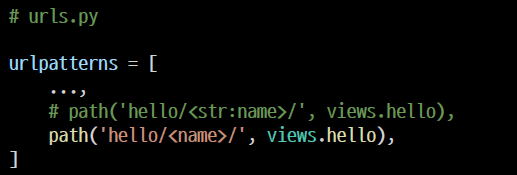

- 기본 타입은 string
  - `str` : 작성하지 않을 경우 기본 값
  - `int` : 0 또는 양의 정수와 매치

- URL의 일부를 변수 `< >` 로 지정하여 view 함수의 인자로 넘길 수 있다
- 즉, 변수 값에 따라 하나의 path()에 여러 페이지를 연결시킬 수 있다

#### 2. View 함수 작성

variable routing으로 할당된 변수를 인자로 받고 템플릿 변수로 사용할 수 있다

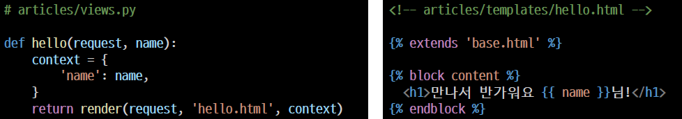

<br>

### Django Template

> 데이터 표현을 제어하는 도구이자 표현에 관련된 로직
>
> Django Template을 이용한 HTML 정적 부분과 동적 컨텐츠 삽입

<br>

### Django Template Language (DTL)

> Django template에서 사용하는 built-in template system
>
> 조건, 반복, 변수 치환, 필터 등의 기능을 제공

#### Variable

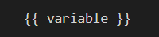

👉 변수명은 영어, 숫자와 밑줄(_)의 조합으로 구성될 수 있으나 밑줄로는 시작 할 수 없다

👉 render()의 세번째 인자로 {'key': value} 와 같이 딕셔너리 형태로 넘겨주며,

여기서 정의한 key에 해당하는 문자열이 template에서 사용 가능한 변수명이 된다

👉 dot(.)를 사용하여 변수 속성에 접근할 수 있다

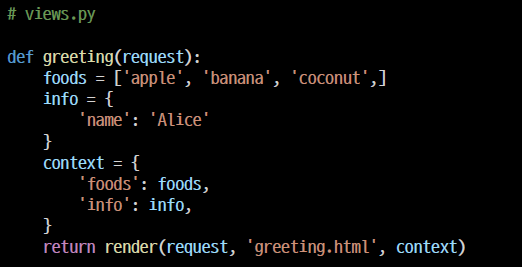

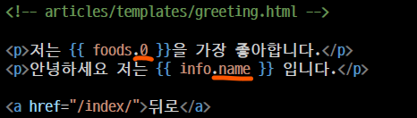

​				`배열의 인덱스` 및 `딕셔너리의 키 값`에 접근 가능

#### Tags

👉 출력 텍스트를 만들거나, 반복 또는 논리를 수행하여 `제어 흐름`을 만드는 등 변수보다 복잡한 일들을 수행

👉 일부 태그는 시작과 종료 태그가 필요

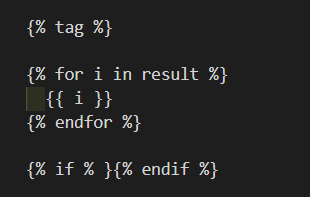

<br>

### Template inheritance (템플릿 상속)

> 자식(하위) 템플릿이 부모 템플릿을 가져와서 확장하는 것

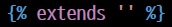

👉 부모 템플릿을 상속받는다는 것을 알림

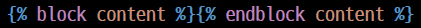

👉 하위 템플릿에서 재지정(overridden)할 수 있는 블록을 정의, `하위 템플릿이 채울 수 있는 공간`

#### 상속 예시

index 템플릿에서 base 템플릿을 상속받음

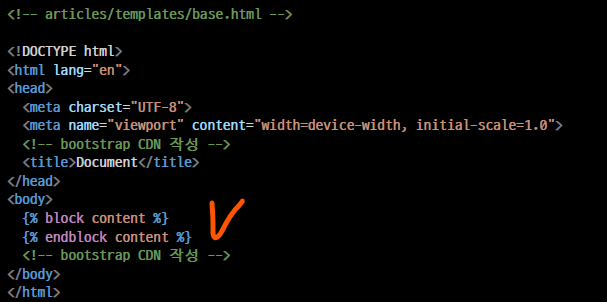

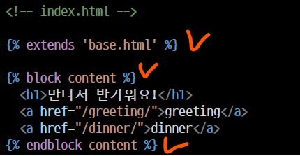

#### BASE_DIR

> `BASE_DIR` 은 BASE 디렉토리가 위치한 경로를 의미. 프로젝트가 위치한 곳. 
>
> 모든 경로는 BASE_DIR을 기준으로 설정된다

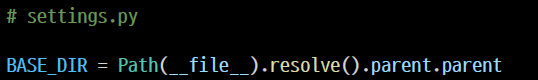

`__file__` : 현재 파일

`Path` : 구상 경로를 객체화 하는것. 즉, 현재 파일의 경로를 객체화해서 표현

`resolve` : 절대경로 반환

`parent` : 부모 경로로 django 프로젝트가 생성된 위치를 표현할 때 사용하며, 

parent가 2번 쓰였으니 2번 옮겨간 위치에 django 프로젝트가 생성되었다

<br>

### Sending and Retrieving form data

> 데이터를 보내고 가져오기

HTML form element를 통해 사용자와 애플리케이션 간의 상호작용 가능

#### HTML &lt;form&gt; element

웹에서 사용자 정보를 입력하는 여러 방식(text, button, submit 등)을 제공하고, 

사용자로부터 할당된 데이터를 서버로 전송하는 역할

- form’s attributes : `action`

  입력 데이터가 전송될 URL을 지정

#### HTML &lt;input&gt; element

사용자로부터 데이터를 입력 받기 위해 사용

- input’s attribute : `name`

  form을 통해 데이터를 제출(submit)했을 때 name 속성에 설정된 값을 서버로 전송하고, 

  서버는 name 속성에 설정된 값을 통해 사용자가 입력한 데이터 값에 접근할 수 있다

<br>

### Trailing URL Slashes

> Django는 URL 끝에 `/` (Trailing slash) 가 없다면 자동으로 붙여주는 것이 기본 설정

기술적인 측면에서, foo.com/bar 와 foo.com/bar/ 는 서로 다른 URL이다
