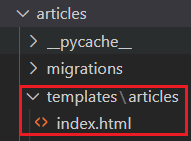
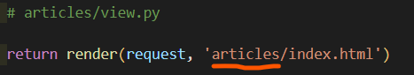
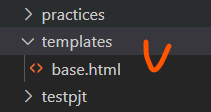
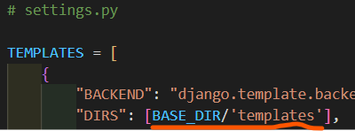
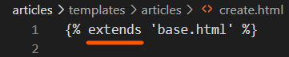
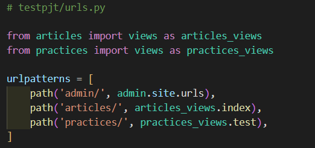
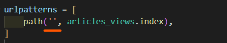
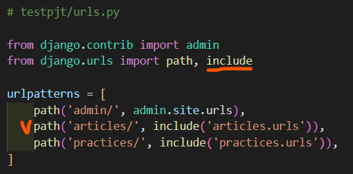
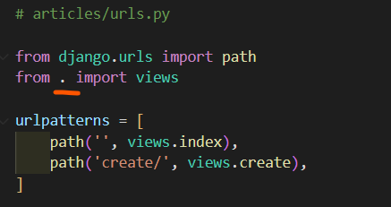

<div align="center">
  <p>
    
  </p>
  <br>
  <h2>Django 04</h2>
  <p>Template namespace, App URL mapping 내용 정리</p>
  <br>
  <br>
</div>


## 🔥 목차

> 처음 세팅
>
> Template namespace
>
> - 개요
> - 이름공간 구분
>
> 최상단 templates 경로 설정
>
> App URL mapping
>
> - 앱 여러개, 주문서 1개만 쓰는 경우
> - 앱마다 주문서(urls) 따로 만들기
>   1. project의 urls.py
>   2. 각각의 앱에서 관리
>

## 🔧세부 내용

### 처음 세팅

1. vscode TERMINAL 에서 가상환경 생성, 실행

    ```bash
    $ cd folder  # 폴더로 이동
    $ python -m venv folder-venv  # 가상환경 생성
    $ ls  # 가상환경 이름 확인
    folder-venv/
    $ source folder-venv/Scripts/activate  # 가상환경 실행
    ```
    
2. Django LTS 버전 설치

    ```bash
    $ pip install django==3.2.13  # 현재 가장 안정적인 django 버전(3.2.13) 설치
    $ pip list  # Django 설치되어있는지 확인 
    ```

3. Django 프로젝트, 앱 생성

   ```bash
   $ django-admin startproject testpjt .  # 프로젝트 시작 명령 [프로젝트이름] [시작할경로]
   $ python manage.py startapp articles  # 앱 생성 [앱 이름]
   $ python manage.py runserver  # 서버 구동
   ```

<br>

### Template namespace

#### 개요

- Django는 기본적으로 app_name/templates/ 경로에 있는 templates 파일들만 찾을 수 있으며, 

​	settings.py의 INSTALLED_APPS에 작성한 app 순서로 template을 검색 후 렌더링 한다

- templates 나눠져 있어도 한 곳으로 여기므로 같은 폴더라고 생각하기

#### 이름공간 구분

Django templates의 기본 경로 자체를 변경할 수는 없기 때문에 물리적으로 이름 공간을 만드는 것

👉 Django templates의 기본 경로에 app과 같은 이름의 폴더를 생성해

​	폴더 구조를 `app_name/templates/app_name/` 형태로 변경



👉 폴더 구조 변경 후 변경된 경로로 해당하는 모든 부분을 수정하기



<br>

### 최상단 templates 경로 설정

👉 기반이 되는 파일은 앱이 아닌 최상단에 위치시킬 수 있다



👉 settings.py 에서 템플릿 위치 설정. `BASE_DIR` 은 절대 경로 / 기초가 되는 곳



👉 다른 파일에서 쉽게 상속 받아서 사용 가능. `extends` 는 최상단을 의미하기 때문



<br>

### App URL mapping

> 앱이 많아졌을 때 urls.py를 각 app에 매핑하는 방법

#### 앱 여러개, 주문서 1개만 쓰는 경우

앱이 여러개면 views 가 중복되므로
각 앱의 view 함수를 다른 이름 (별칭)으로 import 할 수 있다



참고 : path('') 는 루트 경로를 의미. `localhost:8000/`



👉 위의 방법보다는 아래 방법이 더 좋다


#### ⭐ 앱마다 주문서(urls) 따로 만들기

> 프로젝트 urls.py에서 각 앱의 urls.py 파일로 URL 매핑을 위탁할 수 있다

1. 복수 개의 앱의 URL을 project의 urls.py 에서 관리

   

   - `include()` : 다른 URLconf (app1/urls.py) 들을 참조할 수 있도록 돕는 함수

   - 함수 include()를 만나게 되면 URL의 그 시점까지 일치하는 부분을 잘라내고, 

     남은 문자열 부분을 후속 처리를 위해 include된 URLconf로 전달

     

2. 각각의 앱에서 URL을 관리

   
