<div align="center">
  <p>
    
  </p>
  <br>
  <h2>Django 05</h2>
  <p>URL namespace, QuerySet API 내용 정리</p>
  <br>
  <br>
</div>


## 🔥 목차

> Namespace
>
> URL namespace (앱 url 이름)
>
> Naming URL patterns (링크 이름)
>
> Database
>
> - 스키마 (Schema)
> - 테이블 (Table)
>
> ORM
>
> QuerySet API
>
> - Database API
> - Objectsmanager
> - Query
> - QuerySet
>
> Model
>
> - Model 작성하기
> - Model 이해하기
>
> Migrations
>
> 1. makemigrations
> 2. migrate
>
> CRUD
>
> - 준비
> - CREATE (C)
> - READ (R)
> - DELETE (D)

## 🔧세부 내용

### Namespace

> 개체를 구분할 수 있는 범위를 나타내는 namespace (이름공간)

<br>

### URL namespace (앱 url 이름)

> 서로 다른 앱에서 동일한 URL 이름을 사용하는 경우에도 이름이 지정된 `URL을 고유하게` 사용 가능

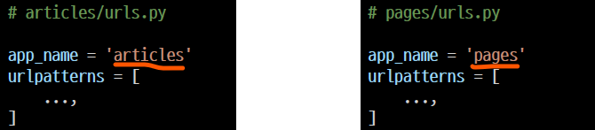

#### URL tag 변화

" : " 연산자를 사용하여 지정 (app_name : url_name)

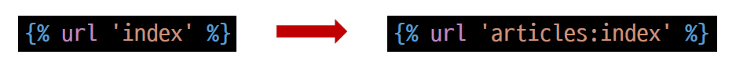

<br>

### Naming URL patterns (링크 이름)

> 링크에 URL을 직접 작성하는 것이 아니라 “ path() ” 함수의 name 인자를 정의해서 사용

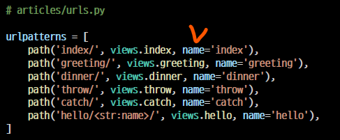

#### Built-in tag "url"

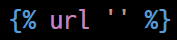

👉 지정된 url 이름과 일치하는 절대 경로 주소를 반환

<br>

### Database

> 체계화된 데이터의 모임
>
> 검색 및 구조화 같은 작업을 보다 쉽게 하기 위해 조직화된 데이터를 수집하는 저장 시스템

#### 스키마 (Schema)

데이터베이스에서 자료의 구조, 표현방법, 관계 등을 정의한 구조 (Structure)

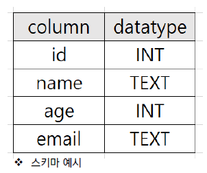

#### 테이블 (Table)

필드와 레코드를 사용해 조직된 데이터 요소들의 집합 (Relation)

- 필드 (field)

  : 컬럼(Column), 속성

- 레코드 (record)

  : 행(Row), 튜플

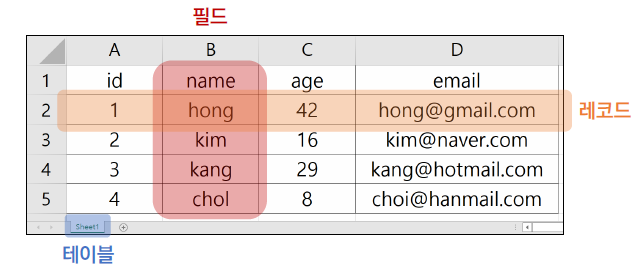

<br>

### ORM

> Object - Relational - Mapping

👉 객체지향 프로그래밍 언어를 사용하여 호환되지 않는 유형의 시스템 간에

​	(Django <-> DB) 데이터를 변환하는 프로그래밍 기술

👉 객체지향 프로그래밍에서 데이터베이스을 연동할 때, 

​	데이터베이스와 객체지향 프로그래밍 언어 간의 호환되지 않는 데이터를 변환하는 프로그래밍 기법

👉 Django는 내장 Django ORM을 사용

👉 한마디로 SQL을 사용하지 않고 데이터베이스를 조작할 수 있게 만들어주는 매개체

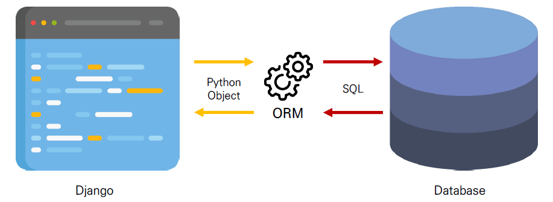

✔ DB를 객체(object)로 조작하기 위해 ORM을 사용

<br>

### QuerySet API

#### Database API

👉 Django가 제공하는 ORM을 사용해 데이터베이스를 조작하는 방법

👉 Model을 정의하면 데이터를 만들고 읽고 수정하고 지울 수 있는 API를 제공

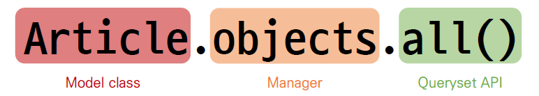

#### Objects manager

👉 Django 모델이 데이터베이스 쿼리 작업을 가능하게 하는 인터페이스

👉 Django는 기본적으로 모든 Django 모델 클래스에 대해 objects 라는 Manager 객체를 자동으로 추가함

👉 이 Manager를 통해 특정 데이터를 조작할 수 있음

👉 DB를 Python class로 조작할 수 있도록 여러 메서드를 제공하는 manager

#### Query

👉 데이터베이스에 특정한 데이터를 보여달라는 요청

👉 이때, 파이썬으로 작성한 코드가 ORM에 의해 SQL로 변환되어 데이터베이스에 전달되며, 

​	데이터베이스의 응답 데이터를 ORM이 QuerySet이라는 자료 형태로 변환하여 우리에게 전달

✔ “쿼리문을 작성한다”

​	: 원하는 데이터를 얻기 위해 데이터베이스에 요청을 보낼 코드를 작성한다

#### QuerySet

👉 데이터베이스에게서전달받은객체목록(데이터모음)

​	: 순회가가능한데이터로써1개이상의데이터를불러와사용할수있음

👉 Django ORM을통해만들어진자료형이며, 필터를걸거나정렬등을수행할수있음

👉 objects manager를사용하여복수의데이터를가져오는querysetmethod를사용할때반환되는객체

👉 단, 데이터베이스가단일한객체를반환할때는QuerytSet이아닌모델(Class)의인스턴스로반환됨

<br>

### Model

> 저장된 데이터베이스의 구조 (layout)

👉 Django는 Model을 통해 데이터에 접근하고 조작

👉 사용하는 데이터들의 필수적인 필드들과 동작들을 포함

👉 일반적으로 각각의 모델은 하나의 데이터베이스 테이블에 매핑 (mapping)

#### Model 작성하기

1. 프로젝트, 앱 생성 & 앱 등록

2. models.py 작성

#### Model 이해하기

- 각 모델은 django.models.Model 클래스의 서브 클래스

  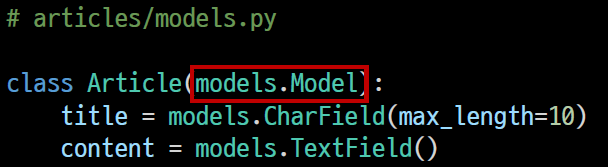

- models 모듈을 통해 어떠한 타입의 DB 필드(컬럼)을 정의할 것인지 정의

  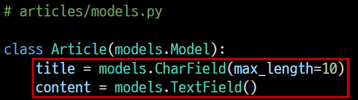

  👉 Article에는 어떤 데이터 구조가 필요한지 정의

  👉 클래스 변수 title과 content은 DB 필드를 나타냄

<br>

### Migrations

#### 1. makemigrations

```bash
$ python manage.py makemigrations  # db.sqlite3의 새로운 테이블을 만들기 위한 설계도 생성
```

명령어 실행 후 migrations/0001_initial.py가 생성된 것을 확인

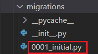

#### 2. migrate

```bash
$ python manage.py migrate  # makemigrations로 만든 설계도를 실제 데이터베이스에 반영하는 과정
```

✔ db.sqlite3 파일에 반영

✔ 결과적으로 모델의 변경사항과 데이터베이스를 동기화
