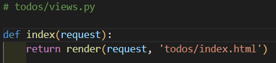
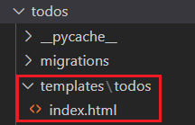
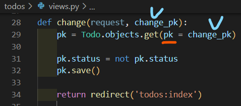

<div align="center">
  <p>
    
  </p>
  <br>
  <h2>Django 06</h2>
  <p>CRUD 진행 과정을 정리 했습니다</p>
  <br>
  <br>
</div>


## 🔥 목차

> 처음 세팅
>
> 페이지 준비
>
> 1. 앱 등록
> 2. Model 정의
> 3. Migrations 진행
> 4. URL 분리
>
> CRUD
>
> Create (생성)
>
> 1. form 태그 사용
> 2.  path 생성
> 3. 함수 생성
>
> Read (조회)
>
> - all( )
> - get( )
>
> Delete (삭제)
>
> 1. 삭제 버튼 생성
> 2. pk 값 동적 인자로 전달
> 3. DB table에 삭제 반영
>
> Update (수정)
>
> 1. 수정 버튼 생성
> 2. pk 값 동적 인자로 전달
> 3. DB table에 수정 반영

## 🔧세부 내용

### 처음 세팅

1. vscode TERMINAL 에서 가상환경 생성, 실행

    ```bash
    $ cd CRUD  # 폴더로 이동
    $ python -m venv venv  # 가상환경 생성
    $ ls  # 가상환경 이름 확인
    venv/
    $ source venv/Scripts/activate  # 가상환경 실행
    ```
    
2. Django LTS 버전 설치

    ```bash
    $ pip install django==3.2.13  # 현재 가장 안정적인 django 버전(3.2.13) 설치
    $ pip list  # Django 설치되어있는지 확인 
    ```

3. Django 프로젝트, 앱 생성

   ```bash
   $ django-admin startproject crud .  # 프로젝트 시작 명령 [프로젝트이름] [시작할경로]
   $ python manage.py startapp todos  # 앱 생성 [앱 이름]
   $ python manage.py runserver  # 서버 구동
   ```

✔ DJANGO 개발은 꼭 `가상 환경을 실행`한 상태로 진행하기 !!

<br>

### 페이지 준비

1. 앱 등록

   

2. Model 정의

   
   
   ​	👉 DB 생성을 위해 table 필드들을 정의한다

3. Migrations 진행

   ```bash
   $ python manage.py makemigrations  # db.sqlite3의 새로운 테이블을 만들기 위한 설계도 생성
   ```
   

   ​	👉 생성된 파일에서 설계도 확인 가능 

   ```bash
   $ python manage.py migrate  # makemigrations로 만든 설계도를 실제 데이터베이스에 반영하는 과정
   ```

   

   ​	👉 db.sqlite3 우클릭 후 Open Database 하면 좌측하단에서 `앱이름_모델이름` 확인 가능

4. URL 분리

   4-1) 앱 (todos) > urls.py 생성

   4-2) 프로젝트(전체)의 urls.py에서 include 통해 path 정의 

   

   ​	👉 어떤 주소 ('url/') 로 `요청`하면 어떤걸 (다른 경로나 VIEW 함수) `응답`할건지를 뜻함

   4-3) 앱 > urls.py 정의

   

   ​	👉 app_name 지정하는 이유는 다른 앱에 있을 수 있는 중복된 파일을 피하기 위해서
   4-4) 앱 > views.py 정의
   
   
   
   ​	👉 html 파일 내용으로 반환됨
   
   4-5) html 파일 생성, 작성
   
   

<br>

### CRUD

> 대부분의 컴퓨터 소프트웨어가 가지는 기본적인 데이터 처리 기능 4가지를 묶어서 일컫는 말

Create / Read / Update / Delete

👉 생성/ 조회/ 수정/ 삭제

<br>

### Create (생성)

1. form 태그 사용

   

2. 이름에 해당하는 path 생성

   

3. create 하기 위한 함수 생성

   

👉 QuerySet API 중 `create()` 메서드 활용. DB에 데이터가 반영된다

<br>

### Read (조회)

> QuerySet API method를 사용해 DB 데이터를 다양하게 조회 가능

#### all( )

전체 데이터 조회


#### get( )

단일 데이터 조회


👉 데이터를 불러와서 변수에 할당하고 html에서 사용할 수 있게 넘겨준다

<br>

### Delete (삭제)

1. 삭제 버튼 생성

   

2. pk 값 동적 인자로 전달

   

3. DB table에 삭제 반영

   

   👉 pk는 table 필드를 나타냄. id도 가능

✔ 동적인자로 전달받은 pk 값을 불러와서 delete()로 삭제

<br>

### Update (수정)

1. 수정 버튼 생성

   

2. pk 값 동적 인자로 전달

   

3. DB table에 수정 반영

   

✔ pk 값을 불러와서 수정하고 save()로 저장
