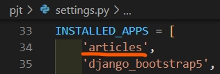
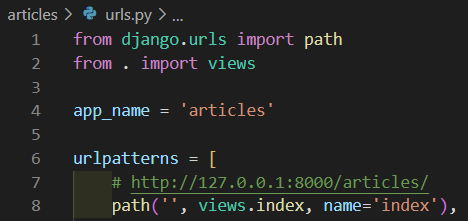
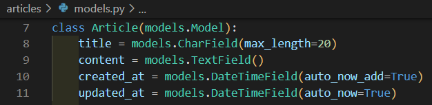
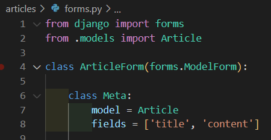
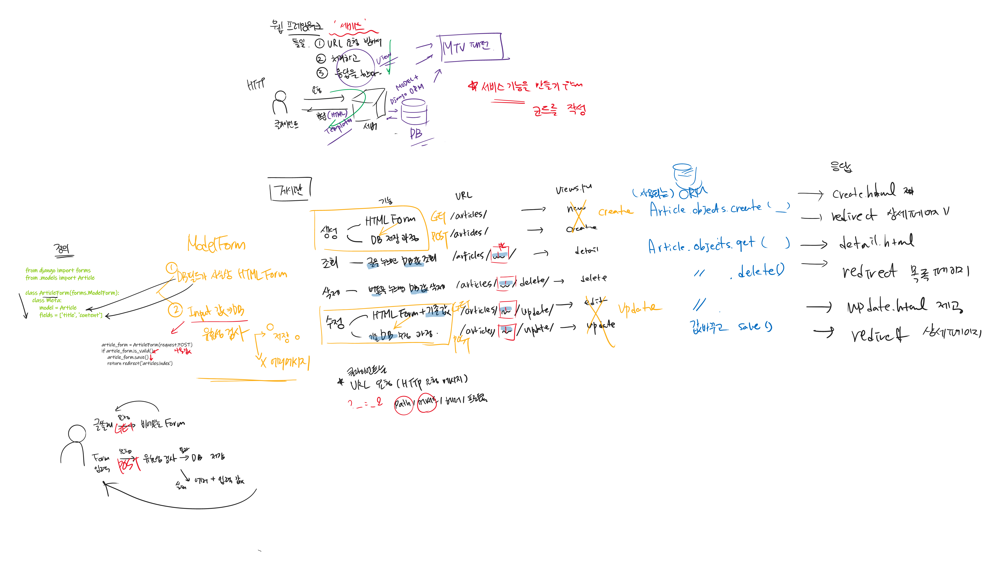

<div align="center">
  <p>
    
  </p>
  <br>
  <h2>Django 08</h2>
  <p>CRUD 진행과정, Admin site, Static file 정리</p>
  <br>
  <br>
</div>


## 🔥 목차

> 처음 세팅
>
> ModelForm 기반 CRUD 진행과정
>
> 1. 앱 등록
> 2. urls.py 설정
> 3. Model 정의 (DB 설계)
>
>    - 클래스 정의
>    - migrations - 설계도 생성
>    - migrate - DB 반영
> 4. CRUD 기능 구현
>    - ModelForm 선언
>    - 게시글 생성
>      - HTML Form 제공
>      - 입력받은 데이터 처리
>    - 게시글 목록
>    - 상세보기
>    - 삭제하기
>    - 수정하기
>
> 강사님 정리 (CRUD, ModelForm)
>

## 🔧세부 내용

### 처음 세팅

1. vscode TERMINAL 에서 가상환경 생성, 실행

    ```bash
    $ cd ModelForm  # 폴더로 이동
    $ python -m venv venv  # 가상환경 생성
    $ ls  # 가상환경 이름 확인
    venv/
    $ . venv/Scripts/activate  # 가상환경 실행
    ```
    
2. Django LTS 버전 설치

    ```bash
    $ pip install django==3.2.13  # 현재 가장 안정적인 django 버전(3.2.13) 설치
    $ pip list  # Django 설치되어있는지 확인 
    $ pip freeze > requirements.txt  # 현재 환경에 pip로 설치되어 있는 라이브러리들을 파일에 모두 출력
    ```

3. Django 프로젝트, 앱 생성

   ```bash
   $ django-admin startproject pjt .  # 프로젝트 시작 명령 [프로젝트이름] [시작할경로]
   $ python manage.py startapp articles  # 앱 생성 [앱 이름]
   $ python manage.py runserver  # 서버 구동
   ```

✔ DJANGO 개발은 꼭 `가상 환경을 실행`한 상태로 진행하기 !!

<br>

### ModelForm 기반 CRUD 진행과정

1. 앱 등록

   > settings.py 파일의 INSTALLED_APPS 에 추가
   
   
   
   <br>

2. urls.py 설정

   > app 단위의 URL 관리를 위해 `include()` 사용

   

   

   <br>

3. Model 정의 (DB 설계)

   - 클래스 정의

     

   - migrations - 설계도 생성

     ```bash
     $ python manage.py makemigrations  # db.sqlite3의 새로운 테이블을 만들기 위한 설계도 생성
     ```

   - migrate - DB 반영

     ```bash
     $ python manage.py migrate  # makemigrations로 만든 설계도를 실제 데이터베이스에 반영하는 과정
     ```
   <br>

4. CRUD 기능 구현

   - ModelForm 선언

     > 선언된 모델에 따른 필드 구성

     ✔ 1) Form 생성          ✔ 2) 유효성 검사

     

   - 게시글 생성

     > 사용자에게 HTML Form 제공, 입력받은 데이터를 처리 (ModelForm 로직으로 변경)

     - HTML Form 제공

       > GET http://127.0.0.1:8000/articles/create/

       (1) urls.py

       ```python
       path('create/', views.create, name='create')
       ```

       (2) views.py

       ```python
       def create(request):
           article_form = ArticleForm()
           context = {
               'article_form': article_form
           }
           return render(request, 'articles/create.html', context=context)
       ```

       (3) articles/create.html

       ```django
       <h1>글쓰기</h1>
       <form action="" method="POST">
        
        {{ article_form.as_p }}
        <input type="submit" value="글쓰기">
       </form>
       ```

       👉 HTML Form 태그 활용시 핵심

       ✔️ 어떤 필드를 구성할 것인지 (`name`, `value`)

       ✔️ 어디로 보낼 것인지 (`action`, `method`)

       <br>
     
     - 입력받은 데이터 처리
       
       > POST http://127.0.0.1:8000/articles/create/
       
       (1) urls.py
       
       ```python
       path('create/', views.create, name='create')
       ```
       
       (2) views.py
       
       ```python
       def create(request):
           if request.method == 'POST':
               article_form = ArticleForm(request.POST)  # 입력받은 데이터들 DB에 저장
               if article_form.is_valid():  # 유효할 경우 실행 (valid)
                   article_form.save()
                   return redirect('articles:index')  # index 페이지로 redirect
           else: 
               article_form = ArticleForm()  # GET 요청 처리
           context = {                       # 유효하지 않을 경우 (invalid)
               'article_form': article_form
           }
           return render(request, 'articles/new.html', context=context)
       ```
       
       <br>
     
   - 게시글 목록
   
     > DB에서 게시글을 가져와서, template에 전달
   
   - 상세보기
   
     > 특정한 글을 본다
   
     ```python
     # http://127.0.0.1:8000/articles/<int:pk>/
     path('<int:pk>/', views.detail, name='detail')
     ```
   
   - 삭제하기
   
     > 특정한 글을 삭제한다
   
     ```python
     # http://127.0.0.1:8000/articles/<int:pk>/delete/
     path('<int:pk>/delete', views.detail, name='delete'),
     ```
   
   - 수정하기
   
     > 특정한 글을 수정한다
     >
     > => 사용자에게 수정할 수 있는 양식을 제공하고 (GET), 특정한 글을 수정한다 (POST)
   
     ```python
     # http://127.0.0.1:8000/articles/<int:pk>/update/
     path('<int:pk>/update/', views.update, name='update')
     ```

<br>

### 강사님 정리 (CRUD, ModelForm)


