<div align="center">
  <p>
    
  </p>
  <br>
  <h2>Django 09</h2>
  <p>Django Auth, 회원가입 내용 정리</p>
  <br>
  <br>
</div>


## 🔥 목차

> 처음 세팅
>
> Django Auth 개요
>
> - Authentication (인증)
> - Authorization (권한, 허가)
>
> Django User Model
>
> AUTH_USER_MODEL
>
> User Model 활용
>
> - User 모델 상속 관계
> - 데이터베이스 초기화 (실습용)
> - 암호 관리
> - User 객체 활용
>
> 사전 설정
>
> - accounts app 생성 및 등록
> - url 분리 및 매핑
>
> 대체하기
>
> 1. 커스텀 User 모델로 지정
>
> 2. User 클래스 작성
>
> 3. migrations 진행
>
> 4. 커스텀 User 모델 등록
>
> 회원 가입
>
> - UserCreationForm
> - UserCreationForm 커스텀
>
> 

## 🔧세부 내용

### 처음 세팅

1. vscode TERMINAL 에서 가상환경 생성, 실행

    ```bash
    $ cd auth  # 폴더로 이동
    $ python -m venv venv  # 가상환경 생성
    $ ls  # 가상환경 이름 확인
    venv/
    $ . venv/Scripts/activate  # 가상환경 실행
    ```
    
2. Django LTS 버전 설치

    ```bash
    $ pip install django==3.2.13  # 현재 가장 안정적인 django 버전(3.2.13) 설치
    $ pip list  # Django 설치되어있는지 확인 
    $ pip freeze > requirements.txt  # 현재 환경에 pip로 설치되어 있는 라이브러리들을 파일에 모두 출력
    ```

3. Django 프로젝트, 앱 생성

   ```bash
   $ django-admin startproject pjt .  # 프로젝트 시작 명령 [프로젝트이름] [시작할경로]
   $ python manage.py startapp articles  # 앱 생성 [앱 이름]
   $ python manage.py startapp accounts  # 앱 2개 사용
   $ python manage.py runserver  # 서버 구동
   ```

✔ DJANGO 개발은 꼭 `가상 환경을 실행`한 상태로 진행하기 !!

<br>

### Django Auth 개요

>  Django authentication system (인증 시스템)은
>
> 인증 (Authentication)과 권한 (Authorization) 부여를 함께 제공(처리) 하고 있음


필수구성은 settings.py의 INSTALLED_APP에 기본으로 되어있음

```python
django.contrib.auth
```


#### Authentication (인증)

- 신원 확인
- 사용자가 자신이 누구인지 확인하는 것

#### Authorization (권한, 허가)

- 권한 부여
- 인증된 사용자가 수행할 수 있는 작업을 결정

<br>

### Django User Model

> Custom User Model로 대체하기

- Django는 기본적인 인증 시스템과 여러 가지 필드가 포함된 `User Model`을 제공,

​	대부분의 개발 환경에서 기본 User Model을 `Custom User Model`로 대체함

- Django는 새 프로젝트를 시작하는 경우 비록 기본 User 모델이 충분 하더라도 

​	커스텀 User 모델을 설정하는 것을 `강력하게 권장`

- 커스텀 User 모델은 기본 User 모델과 동일하게 작동 하면서도 필요한 경우 `나중에 맞춤 설정`할 수 있기 때문

✔ 모델을 변경하는 것은 데이터베이스를 변경하는 것과 같으므로 
	미리 커스텀을 안하면 나중에 바꾸기 힘들다

<br>

### AUTH_USER_MODEL

> 프로젝트에서 User를 나타낼 때 사용하는 모델

- 프로젝트가 진행되는 동안 (모델을 만들고 마이그레이션 한 후) 변경할 수 없음

- 프로젝트 시작 시 설정하기 위한 것이며 , 참조하는 모델은 첫 번째 마이그레이션에서 사용할 수 있어야 함

​	👉 즉, 첫번째 마이그레이션 전에 확정 지어야 하는 값

다음과 같은 기본 값을 가지고 있음

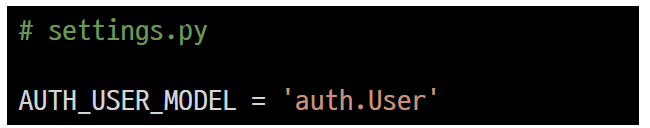

<br>

### User Model 활용

#### User 모델 상속 관계

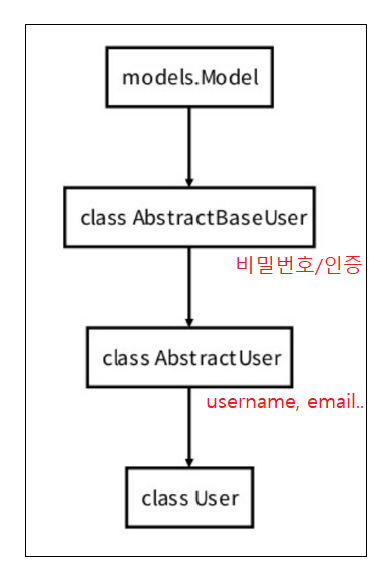

​	👉 AbstractUser 모델 상속해서 Custom  진행함

<br>

#### 데이터베이스 초기화 (실습용)

✔ 데이터베이스 초기화 후 마이그레이션 (`프로젝트 중간`일 경우)

1. migrations 파일 삭제
   - migrations 폴더 및 __ init __.py 는 삭제하지 않음
   - 번호가 붙은 파일만 삭제
2. db.sqlite3 삭제
3. migrations 진행
   - makemigrations
   - migrate

✔ custom User로 변경된 테이블 확인

​	👉 이제 auth_user 테이블이 아니라 accounts_user 테이블을 사용하게 됨
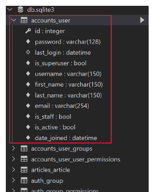

<br>

#### User 객체 활용

User 객체는 인증 시스템의 가장 기본

기본 속성

- username
- password
- email
- first_name
- last_name

<br>

#### 암호 관리

- 회원가입시 일반적으로 암호 (password) 저장이 필수적이며 , 별도의 처리가 필요

- Django에서는 기본으로 PBKDF2 (Password Based Key Derivation Function) 사용하여 저장

  👉 단방향 해시함수를 활용하여 비밀번호를 다이제스트로 `암호화`하며 , 이는 `복호화가 불가능`함

<br>

#### User 객체 활용

- User 생성

  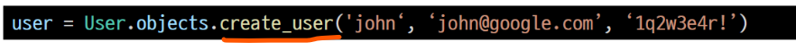

  👉 비밀번호를 암호화해서 자동으로 저장됨

- User 비밀번호 변경

  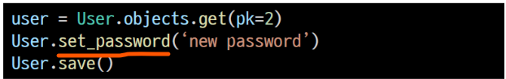

  👉 set_password 함수는 암호화 과정을 거쳐주므로 변경할때 필수

- User 인증 (비밀번호 확인)

  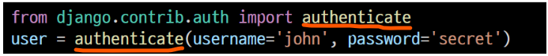

  👉 정보가 일치하는지 확인하려면 authenticate 함수 사용


<br>

### 사전 설정

#### accounts app 생성 및 등록

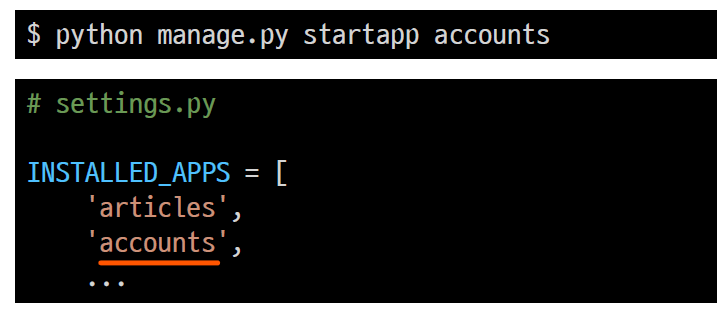

✔ auth와 관련한 경로나 키워드들을 Django 내부적으로 accounts라는 이름으로 사용하고 있기 때문에 

​	되도록 `accounts`로 지정하는 것을 권장

#### url 분리 및 매핑

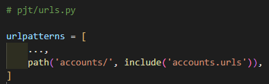

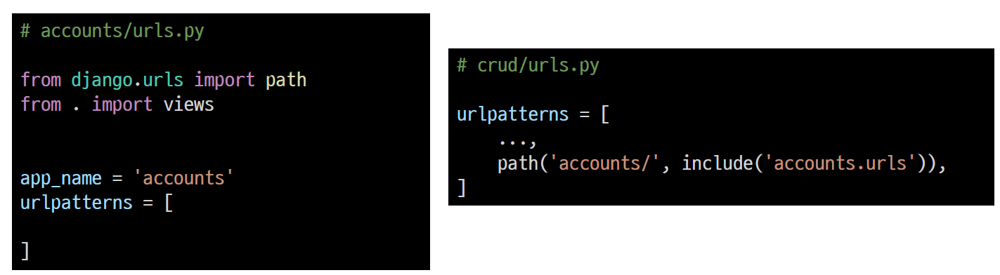


<br>

### 대체하기


1. 커스텀 User 모델로 지정


​		Django 프로젝트에서 User 를 나타내는데 사용하는 모델을 `커스텀 User 모델`로 지정

​		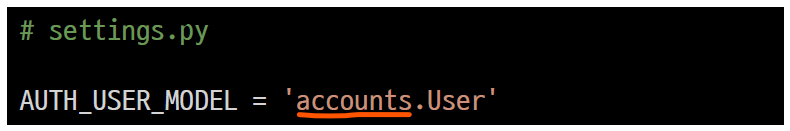

2. User 클래스 작성

   - AbstractUser를 상속받는 커스텀 User 클래스 작성
   - 기존 User 클래스도 `AbstractUser를 상속` 받기 때문에 커스텀 User 클래스도 완전히 같은 모습을 가지게 된다

   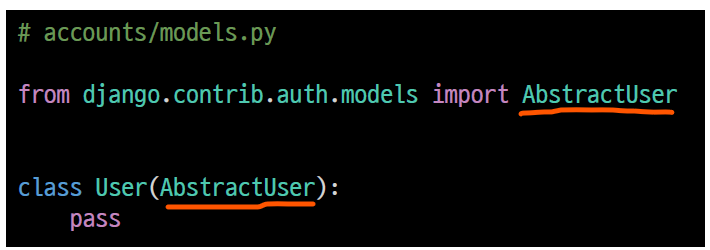

 3. migrations 진행

    모델 만들었으니 makemigrations, migrate 진행

    ```bash
    $ python manage.py makemigrations  # 테이블을 만들기 위한 설계도 생성
    $ python manage.py migrate  # 데이터베이스에 반영
    ```

    📌 참고

    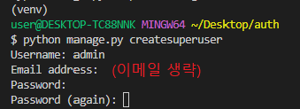

    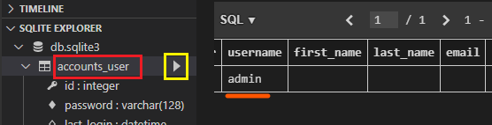

​			👉 지정한 곳 (accounts_user)에 admin이 저장된 것을 확인할 수 있다

​	✔ 모델을 직접 정의한게 아니라 장고 내부에 있는걸 가져와서 (클래스 상속)  바로 migrate까지 진행한 상태

4.  커스텀 User 모델 등록

   기본 User 모델이 아니기 때문에 등록하지 않으면 `admin site`에 출력되지 않음
   
   👉 admin.py에 등록

​		


### 회원 가입

#### UserCreationForm

> 주어진 username과 password로 권한이 없는 새 user를 생성하는 ModelForm

3 개의 필드를 가짐

- username (from the user model)
- password1
- Password2


#### UserCreationForm 커스텀

- 기존 UserCreationForm을 상속받아 User 모델 재정의


- get_user_model()

  👉 현재 프로젝트에서 활성화된 사용자 모델 (active user)을 반환

  👉 Django에서 User 클래스는 커스텀을 통해 변경 가능하여 직접 참조하는 대신 `get_user_model` 사용할 것을 권장함

- CustomUserCreationForm() 으로 대체하기

- 회원가입 진행 후 테이블 확인

#### CustomUserCreationForm() 으로 대체하기


#### 회원가입 진행 후 테이블 확인
