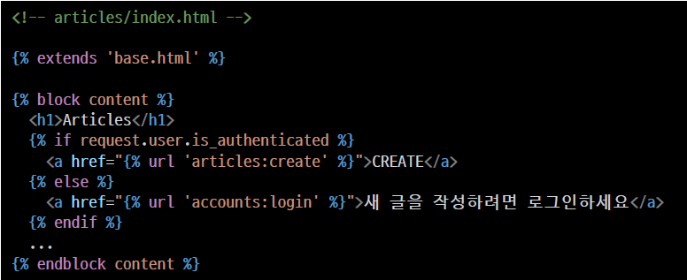

<div align="center">
  <p>
    
  </p>
  <br>
  <h2>Django 10</h2>
  <p>로그인, 로그아웃 내용 정리</p>
  <br>
  <br>
</div>


## 🔥 목차

> [처음 세팅](#처음-세팅)
>
> HTTP
>
> 쿠키 (Cookie)
>
> - 쿠키 사용 예시
> - 쿠키 사용 목적
>
> 세션 (Session)
>
> - 쿠키 Lifetime (수명)
> - Session in Django
>
> [Login](#Login)
>
> - AuthenticationForm
> - login()
> - 로그인 로직 작성
> - get_user()
>
> Authentication with User
>
> - 현재 로그인 되어있는 유저 정보 출력
> - context processors
> - 템플릿 변수 {{ user }}
>
> Logout
>
> -  logout()
>
> - 로그아웃 출력 확인 및 테스트
>
> [Limiting access to logged-in users](#Limiting-access-to-logged-in-users)
>
> - 로그인 사용자에 대해 접근을 제한하는 2 가지 방법
>
> - is_authenticated
> - is_authenticated 적용
> - login_required
> - login_required 적용 확인
> - "next" query string parameter 대응
> - "next" query string parameter 주의사항
>
> [로그인 기능 구현](#로그인-기능-구현)
>
> 1. URL 설정
> 2. 로그인 로직처리
> 3. 로그인 템플릿 생성
>
> 📌 현재 로그인 되어있는 유저 정보 출력
>
> [로그아웃 기능 구현](#로그아웃-기능-구현)

## 🔧세부 내용

### 처음 세팅

1. vscode TERMINAL 에서 가상환경 생성, 실행

    ```bash
    $ cd auth  # 폴더로 이동
    $ python -m venv venv  # 가상환경 생성
    $ ls  # 가상환경 이름 확인
    venv/
    $ . venv/Scripts/activate  # 가상환경 실행
    ```
    
2. Django LTS 버전 설치

    ```bash
    $ pip install django==3.2.13  # 현재 가장 안정적인 django 버전(3.2.13) 설치
    $ pip list  # Django 설치되어있는지 확인 
    $ pip freeze > requirements.txt  # 현재 환경에 pip로 설치되어 있는 라이브러리들을 파일에 모두 출력
    ```

3. Django 프로젝트, 앱 생성

   ```bash
   $ django-admin startproject pjt .  # 프로젝트 시작 명령 [프로젝트이름] [시작할경로]
   $ python manage.py startapp articles  # 앱 생성 [앱 이름]
   $ python manage.py startapp accounts  # 앱 2개 사용
   $ python manage.py runserver  # 서버 구동
   ```

✔ DJANGO 개발은 꼭 `가상 환경을 실행`한 상태로 진행하기 !!

<br>

### HTTP

> Hyper Text Transfer Protocol

- HTML 문서와 같은 리소스들을 가져올 수 있도록 해주는 프로토콜 규칙 , 규약

- 웹 (WWW)에서 이루어지는 모든 데이터 교환의 기초
- 클라이언트 서버 프로토콜이라고도 부름

#### 요청과 응답

- 요청 (request)

  클라이언트 (브라우저)에 의해 전송되는 메시지

- 응답 (reponse)

  서버에서 응답으로 전송되는 메시지

#### HTTP 특징

- 비 연결 지향 (connectionless)

  서버는 요청에 대한 응답을 보낸 후 연결을 끊음

  - 예를 들어 우리가 네이버 메인 페이지를 보고 있을 때 우리는 네이버 서버와 연결되어 있는 것이 아님
  - 네이버 서버는 우리에게 메인 페이지를 응답하고 연결을 끊은 것

- 무상태 (stateless)

  - 연결을 끊는 순간 클라이언트와 서버 간의 통신이 끝나며 상태 정보가 유지되지 않음
  - 클라이언트와 서버가 주고받는 메시지들은 서로 완전히 독립적

<br>

### 쿠키 (Cookie)

> 서버가 사용자의 웹 브라우저 (클라이언트)에 전송하는 작은 데이터 조각

- 브라우저 (클라이언트)는 쿠키를 로컬에 KEY-VALUE의 데이터 형식으로 저장
- 동일한 서버에 재요청 시 저장된 쿠키를 함께 전송  
- 쿠키는 서로 다른 요청이 동일한 브라우저로부터 발생한 것인지 판단할 때 주로 사용됨
- 상태가 없는 (stateless) HTTP에서 상태 정보를 관리, 사용자는 로그인 상태를 유지할 수 있음

#### 쿠키 사용 예시


#### 쿠키 사용 목적

- 세션 관리 (Session management)

  로그인, 아이디 자동완성, 공지 하루 안보기, 팝업 체크, 장바구니 등의 정보 관리

- 개인화 (Personalization)

  사용자 선호, 테마 등의 설정

- 트래킹 (Tracking)

  사용자 행동을 기록 및 분석

<br>

### 세션 (Session)

> 사이트와 특정 브라우저 사이의 state (상태)를 유지시키는 것

- 클라이언트가 서버에 접속하면 서버가 특정 session id를 발급하고, 클라이언트는 session id를 쿠키에 저장
  - 클라이언트가 다시 동일한 서버에 접속하면 요청과 함께 쿠키 (session id가 저장된)를 서버에 전달
  - 쿠키는 요청 때마다 서버에 함께 전송 되므로 서버에서 session id를 확인해 알맞은 로직을 처리
- session id는 세션을 구별하기 위해 필요하며, 쿠키에는 session id만 저장

#### 쿠키 Lifetime (수명)

- Session cookie

  - 현재 세션 (current session)이 종료되면 삭제됨
  - 브라우저 종료와 함께 세션이 삭제됨

- Persistent cookies

  Expires 속성에 지정된 날짜 혹은 Max Age 속성에 지정된 기간이 지나면 삭제됨

#### Session in Django

- Django는 database-backed sessions 저장 방식을 기본 값으로 사용
  - session 정보는 Django DB의 django_session 테이블에 저장
  - 설정을 통해 다른 저장방식으로 변경 가능
- Django는 특정 session id를 포함하는 쿠키를 사용해서 각각의 브라우저와 사이트가 연결된 session을 확인함

<br>

### Login

#### AuthenticationForm

> 로그인을 위한 built-in form

- 로그인 하고자 하는 사용자 정보를 입력 받음 (username, password)
- ModelForm이 아닌 일반 Form을 상속 받고 있으며, request를 첫번째 인자로 취함

#### login()

> 인증된 사용자를 로그인

- 유저의 ID를 세션에 저장하여 세션을 기록

- login (`request`, `user`, backend=None)

- HttpRequest 객체와 User 객체가 필요

  👉 유저 정보는 반드시 인증된 유저 정보여야 함

  - authenticate() 함수를 활용한 인증

  - AuthenticationForm을 활용한 is_valid

#### 로그인 로직 작성

- 일반적인 ModelForm 기반의 Create 로직과 동일하지만, ModelForm이 아닌 `Form`으로 필수 인자 구성이 다름
- DB에 저장하는 것 대신 `세션`에 유저를 기록하는 함수 호출함
  - View 함수와 이름이 동일하여 변경 후 호출
  - 로그인 URL이 '/accounts/login/' 에서 변경되는 경우 settings.py LOGIN_URL을 변경하여야 함

#### get_user()

> AuthenticationForm의 인스턴스 메서드

유효성 검사를 통과했을 경우 로그인 한 사용자 객체를 반환

<br>

### Authentication with User

#### context processors

- 템플릿이 렌더링 될 때 호출 가능한 컨텍스트 데이터 목록 (settings.py 참고)
- 작성된 컨텍스트 데이터는 기본적으로 템플릿에서 사용 가능한 변수로 포함됨
- 즉, django에서 자주 사용하는 데이터 목록을 미리 템플릿에 로드 해 둔 것

#### 템플릿 변수 {{ user }}

`django.contrib.auth.context_processors.auth` 때문에 context 데이터 없이 user 변수 사용 가능

- 클라이언트가 로그인한 경우 User 클래스의 인스턴스

- 클라이언트가 로그인하지 않은 경우 AnonymousUser 클래스의 인스턴스

<br>

### Logout

#### logout()

- logout (request)
- 요청 유저에 대한 세션 정보를 삭제함
  - DB에서 session data 삭제
  - 클라이언트의 쿠키에서 sessionid 삭제
- HttpRequest 객체를 인자로 받고 반환 값이 없음
- 사용자가 로그인하지 않은 경우 오류를 발생시키지 않음

<br>

### Limiting access to logged in users

#### 로그인 사용자에 대해 접근을 제한하는 2 가지 방법

- is_authenticated attribute를 활용한 조건문
- The login_required decorator를 활용한 view 제한

#### is_authenticated

> 사용자가 인증 되었는지 여부를 알 수 있는 방법

- User model의 속성 (attributes) 중 하나

- 모든 User 인스턴스에 대해 항상 True 인 읽기 전용 속성

  📌 AnonymousUser에 대해서는 항상 False

- 일반적으로 request.user에서 이 속성을 사용 (request.user.is_authenticated)

- 권한 (permission)과는 관련이 없으며, 사용자가 활성화 상태 (active) 이거나
  유효한 세션 (valid session)을 가지고 있는지도 확인하지 않음

#### is_authenticated 적용

- 로그인과 비로그인 상태에서 출력되는 링크를 다르게 설정하기

  

- 인증된 사용자만 게시글 작성 링크를 볼 수 있도록 처리하기
  - URL을 직접 입력하면 게시글 작성 페이지로 갈 수 있음
  - View에서의 처리도 반드시 필요함
  
  

- 인증된 사용자라면 로그인 로직을 수행할 수 없도록 처리

  

#### login_required 

- login_required decorator

  - 사용자가 로그인 되어 있으면 정상적으로 view 함수를 실행

  - 로그인 하지 않은 사용자의 경우 settings.py의 LOGIN_URL 문자열 주소로 redirect

    📌 LOGIN_URL 의 기본 값은 /accounts/login

- 로그인 상태에서만 글을 작성/수정/삭제 할 수 있도록 변경

  

#### login_required 적용 확인

- /articles/create/로 브라우저에 직접 요청
- 로그인 페이지로 리다이렉트 및 URL 확인
  - 인증 성공시 사용자가 redirect 되어야하는 경로는 "next"라는 쿼리 문자열 매개 변수에 저장됨
  - 예시) /accounts/login/?next=/articles/create/

#### "next" query string parameter 대응


#### "next" query string parameter 주의사항

- 만약 login 템플릿에서 form action이 작성되어 있다면 동작하지 않음

- 해당 action 주소 next 파라미터가 작성 되어있는 현재 url이 아닌 /accounts/login/

  으로 요청을 보내기 때문


<br>

### 로그인 기능 구현

1. URL 설정

   

2. 로그인 로직처리

   

   ​	👉 사용자인지 확인하고 👉 django_session 테이블 (세션)에 기록 👉 게시글 목록 페이지로 redirect

   ✔ AuthenticationForm은 ModelForm이 아니라 forms.Form 상속 받고 있으므로 save()는 없음

   ✔ login 함수 이름이 View 함수와 겹치므로 as 통해서 변경 후 호출

   ✔ login 함수 (auth_login)는 request, `user 객체`를 인자로 받음

   ✔ `user 객체`는 인증된 유저정보를 form에서 가져올 수 있다

3. 로그인 템플릿 생성

   

   👉 회원가입된 상태에서 로그인 하면 게시글 목록 페이지로 이동한다

<br>

📌 현재 로그인 되어있는 유저 정보 출력


<br>

### 로그아웃 기능 구현


