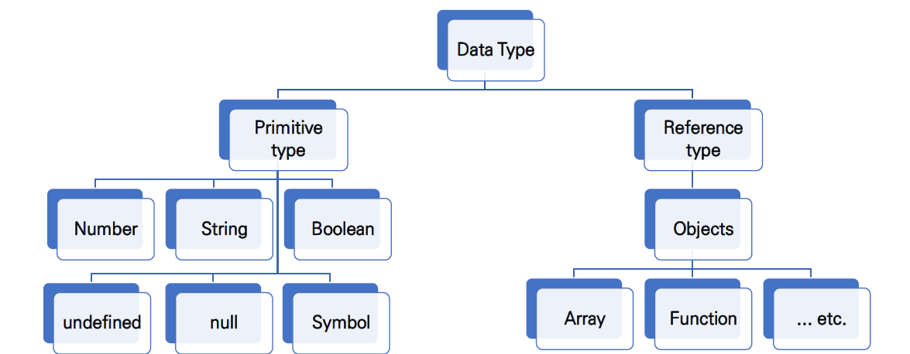

<p align='middle'>
	
</p>
<br>

<h2 align='middle'>자바스크립트 기초2</h2>

<p align='middle'>자바스크립트(ES6) 공부 후 정리 하였습니다</p>
<br>
<br>


## 🔥 Goal

- 강의에서 봤던 예시 코드들을 따라서 실행해본다
- 자바스크립트 기초를 탄탄히 다진다
- 자주 사용했던 언어(Python)와 다른 문법을 자세히 살펴본다


## ⭐목차

> 변수와 식별자
>
> - 선언, 할당, 초기화
> - let, const 비교
>
> 자료형 (Data type)
>
> - 원시 타입 (Primitive type)
> - 참조 타입 (Reference type)
>
> 연산자
>
> - 논리 연산자
> - 삼항 연산자
>
> 조건문
>
> - if, else if, else
> - switch문
>
> 반복문
>
> - while
> - for
> - for...in
> - for...of
>
> 화살표 함수 (Arrow Function)
>
> 배열 (Arrays)
> 
>- 메서드 - forEach
> - 메서드 - map
>- 이외 메서드
> 
> 객체 (Objects)


## 🔧세부 내용

### 변수와 식별자

- 선언

  : 번수를 생성

- 할당

  : 선언된 변수에 값을 저장

- 초기화

  : 선언된 변수에 처음으로 값을 저장

```javascript
let foo           // 선언
console.log(foo)  // undefined

foo = 11          // 할당
console.log(foo)  // 11

let bar = 0       // 선언 + 할당
console.log(bar)  // 0
```


- let, const 비교

  - 차이

    - let 재할당 가능
    - const 재할당 불가능
  
  - 공통
  
    - 둘다 재선언 불가능
  
    - 블록 스코프 (block scope)
  
      👉 if, for, 함수 등의 중괄호 내부를 가리킴
  
      👉 블록 스코프를 가지는 변수는 블록 바깥에서 접근 불가능
  
    

### 자료형 (Data type)

- 원시 타입 (Primitive type)

  > 객체(object)가 아닌 기본 타입

- 참조 타입 (Reference type)

  > 객체(object) 타입의 자료형




### 연산자

- 논리 연산자

  👉 and 연산은 ‘&&’ 연산자를 이용

  👉 or 연산은 ‘||’ 연산자를 이용

  👉 not 연산은 ‘!’ 연산자를 이용

  

- 삼항 연산자

  : 왼쪽 조건식이 참이면 콜론(:) 앞의 값을 사용, 그렇지 않으면 콜론(:) 뒤의 값 사용

  ```javascript
  console.log(true ? 1 : 2)  // 1
  console.log(false ? 1 : 2)  // 2
  ```

  


### 조건문

- if, else if, else

- switch문

  👉 표현식의 결과값과 case문의 오른쪽 값을 비교

  👉 break문을 만나거나 default문을 실행할 때까지 조건문실행

  ```javascript
  const nation = 'Korea'
  
  switch(nation) {
    case 'Korea': {
      console.log('안녕하세요')
    }
    default: {
      console.log('Hello')
    }
  }
  ```

  

### 반복문

- while

- for

  세미콜론(;)으로 구분되는 세부분으로 구성

  - initialization

    : 최초 반복문 진입시 1회만 실행되는 부분

  - condition

    : 매 반복 시행 전 평가되는 부분

  - expression

    : 매반복시행이후평가되는부분

  ```javascript
  for (let i = 0; i < 6; i++) {
      console.log(i)
  }
  ```
  
- for...in

  객체(object)의 속성(key)들을 순회할 때 사용

  ```javascript
  const capitals = {
      korea: 'seoul',
      france: 'paris'
  }
  
  for (let capital in capitals) {
      console.log(capital)  // korea, france
  }
  ```

- for...of

  반복가능한(iterable) 객체를 순회하며 값을 꺼낼 때 사용

  ```javascript
  const fruits = ['딸기', '바나나', '메론']
  
  for (let fruit of fruits) {
      console.log(fruit)  // 딸기, 바나나, 메론 
  }
  ```


### ⚡함수⚡

- 함수 정의하는 방법

  - 함수 선언식

    ```javascript
    function name(args) {
    }
    ```

    3가지 부분으로 구성

    - 함수의 이름 (name)
    - 매개변수 (args)
    - 함수 body (중괄호 내부)

  - 함수 표현식

    - 함수를 표현식 내에서 정의하는 방식
    - 함수의 이름을 생략하고 정의 가능 (익명 함수)

    ```javascript
    const name = function (args) {
    }
    ```

  👉 함수 표현식 권장 (호이스팅 x)


### 화살표 함수 (Arrow Function)

: 함수를 비교적 간결하게 정의할 수 있는 문법

```javascript
const arrow1 = function (name) {
    return `hello, ${name}`
}

// 1. function 키워드 삭제
const arrow2 = (name) => { return `hello, ${name}` }

// 2. 매개변수가 1개일 경우에만 ( ) 생략 가능
const arrow3 = name => { return `hello, ${name}` }

// 3. 함수 바디가 return을 포함한 표현식 1개일 경우에 { } & return 삭제
const arrow4 = name => `hello, ${name}`
```


### 배열 (Arrays)

```javascript
const numbers = [1, 2, 3, 4, 5]

console.log(numbers[0])      // 1
console.log(numbers[-1])     // undefined
console.log(numbers.length)  // 5
```

- 메서드 - forEach

  - array.forEach(callback(element[, index[, array]]))
  - 배열의 각 요소에 대해 콜백 함수를 한 번씩 실행
  - 콜백 함수는 3가지 매개변수로 구성
    - element : 배열의 요소
    - index : 배열 요소의 인덱스
    - array : 배열 자체
  - 반환 값(return)이 없는 메서드

  ```javascript
  const fruits = ['딸기', '수박']
  
  fruits.forEach((fruit, index) => {
      console.log(fruit, index)
      // 딸기 0
      // 수박 1
  })
  ```

- 메서드 - map

  - array.forEach(callback(element[, index[, array]]))
  - 배열의 각 요소에 대해 콜백 함수를 한 번씩 실행
  - 콜백 함수의 반환값을 요소로 하는 새로운 배열 반환

  ```javascript
  const numbers = [1, 2, 3, 4, 5]
  
  const doubleNums = numbers.map((num) => {
      return num * 2
  })
  
  console.log(doubleNums)  // [2, 4, 6, 8, 10]
  ```

- 이외 메서드
  - filter
  - reduce
  - find
  - some
  - every


### 객체 (Objects)

- 객체는 속성(property)의 집합이며, 중괄호 내부에 key와 value의 쌍으로 표현
- key는 문자열 타입만 가능
- value는 모든 타입(함수포함) 가능
- 객체 요소 접근은 점 또는 대괄호로 가능

```javascript
const me = {
    name: 'min',
    phoneNumber: '01012345678',
    'samsung': {
        buds: 'Buds pro',
        galaxy: 's20',
    },
}

console.log(me.name)
console.log(me['samsung'])
console.log(me['samsung'].buds)
```
