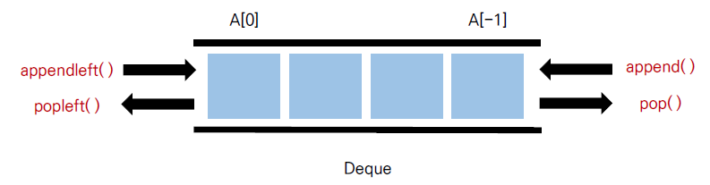

## 🧊 큐 (Queue)

> Queue는 한 쪽 끝에서 데이터를 넣고 , 다른 한 쪽에서만 데이터를 뺄 수 있는 자료구조
>
> 가장 먼저 들어온 데이터가 가장 먼저 나가므로 FIFO(First in First out, 선입선출) 방식

<br>

### ☁ 리스트를 이용한 큐 자료구조



👉 덱은 양 방향 삽입 , 삭제가 모두 큐보다 훨씬 빠르다

​	따라서 데이터의 삽입 , 삭제 많은 경우 시간을 크게 단축 시킬 수 있다

👉 단점은 데이터를 뺄 때 큐 안에 있는 데이터가 많은 경우 비효율적이다

<br>

### ☁ 큐와 덱 풀이 비교

#### 큐를 이용한 풀이

``` python
n = int input
queue = list(range(1, n + 1))

while len(queue) > 1:
	print(queue.pop(0), end=" ")
    queue.append(queue.pop(0))
    
print(queue[0])
```


#### 덱을 이용한 풀이

```python
from collections import deque

n = int(input())
queue = deque(range(1, n + 1))

while len (queue) > 1:
	print(queue.popleft(), end=" ")
	queue.append(queue.popleft())

print(queue[0])
```
